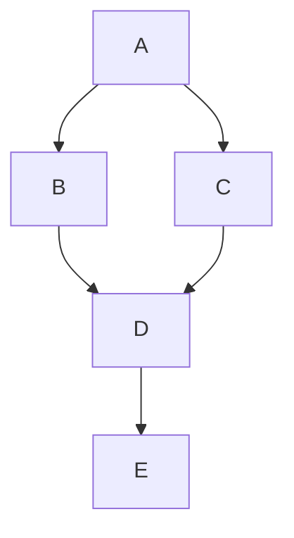
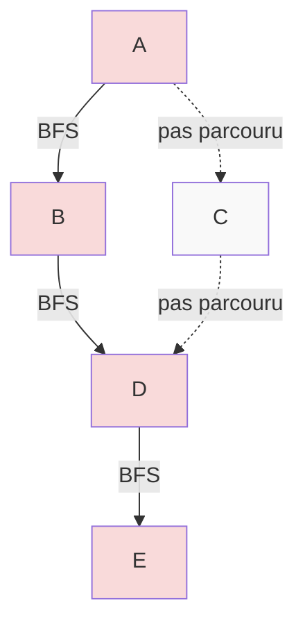
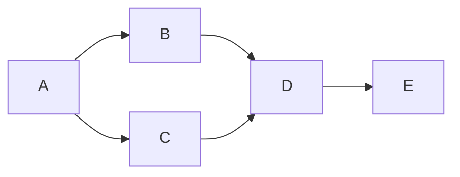
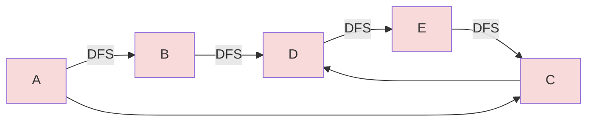
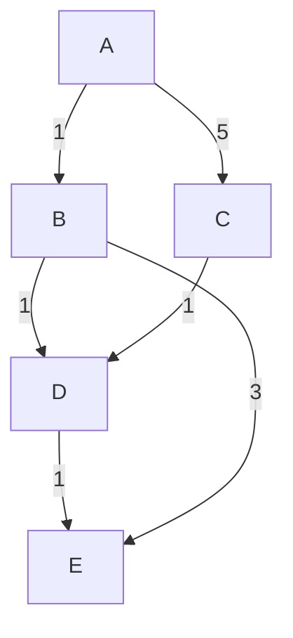
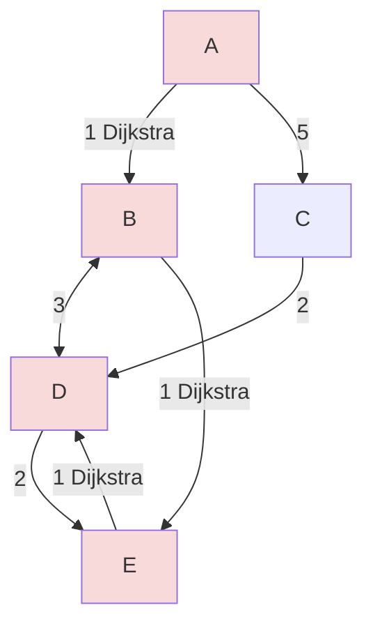
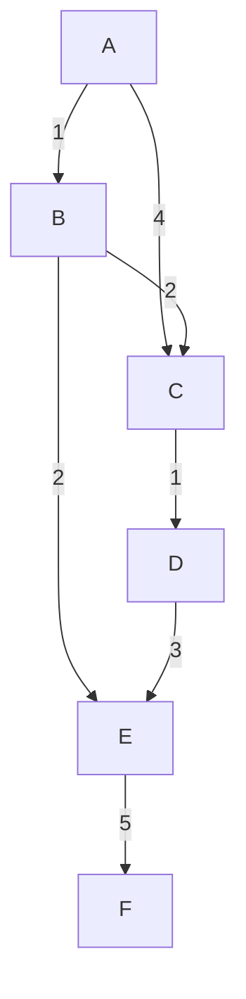
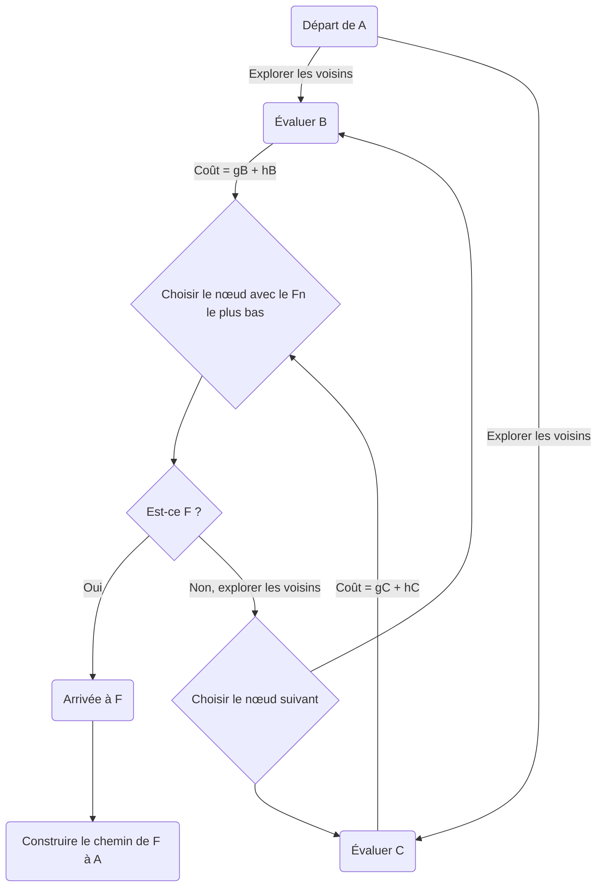

## Leçon 1: Introduction à l'Algorithmique en Python

### Introduction théorique

**Définition d'un algorithme**
Un algorithme est une série d'instructions ordonnées et finies qui, lorsqu'elles sont suivies, mènent à la résolution d'un problème donné. En informatique, les algorithmes sont au cœur de la programmation, permettant de créer des solutions systématiques et efficaces à des problèmes complexes.

**Histoire brève et importance des algorithmes**
Le terme "algorithme" tire son origine du nom du mathématicien du 9ème siècle, Al-Khwarizmi. Historiquement, les algorithmes ont été utilisés pour le calcul numérique, la résolution d'équations, et la navigation. Aujourd'hui, ils sont essentiels dans des domaines aussi divers que le traitement de données, la recherche opérationnelle, l'intelligence artificielle, et bien plus encore.

**Algorithmes dans la vie quotidienne**
Les algorithmes ne se limitent pas à l'informatique. Ils sont partout autour de nous : dans les recettes de cuisine, les itinéraires routiers, ou encore les instructions pour assembler des meubles.

### Algorithmes vs Fonctions en Python

**Rappel sur les fonctions en Python**
Les fonctions sont des blocs de code conçus pour effectuer une tâche spécifique et peuvent être réutilisés dans le programme.

**Comparaison avec les algorithmes**
Contrairement aux fonctions, qui sont des constructions du langage de programmation, les algorithmes sont des concepts indépendants du langage utilisé. Ils peuvent être implémentés dans n'importe quel langage de programmation, y compris Python.

### Pensée algorithmique

**Analyser un problème**
La première étape pour concevoir un algorithme est de comprendre clairement le problème. Cela implique de définir de façon précise ce qui est demandé, quelles sont les entrées disponibles, et quelle doit être la sortie.

**Décomposer le problème en étapes**
Une fois le problème analysé, il convient de le découper en petites étapes. Chaque étape doit mener progressivement vers la solution.

**Identifier les entrées et les sorties**
Les entrées sont les données sur lesquelles l'algorithme va travailler, et les sorties sont les résultats de l'opération algorithmique.

### Exemple introductif en Python

**Présentation de l'exemple**
Nous allons écrire un algorithme pour calculer la moyenne d'une liste de nombres.

**Écriture de l'algorithme étape par étape**
1. Prendre en entrée la liste des nombres.
2. Calculer la somme de tous les nombres.
3. Diviser la somme par le nombre d'éléments dans la liste.
4. Retourner le résultat.

**Implémentation en Python**

```python
def calculer_moyenne(nombres):
    somme = sum(nombres)
    moyenne = somme / len(nombres)
    return moyenne

# Exemple de mise en pratique de la pensée algorithimique
liste_nombres = [4, 8, 15, 16, 23, 42]
moyenne = calculer_moyenne(liste_nombres)
print("La moyenne est:", moyenne)
```

#### Exercice dirigé

**Énoncé de l'exercice**
Écrire un algorithme pour trouver le nombre le plus grand dans une liste.

**Implémentation collective en Python**

```python
def trouver_max(nombres):
    maximum = nombres[0]  # On suppose le premier élément comme max
    for nombre in nombres:
        if nombre > maximum:
            maximum = nombre
    return maximum

# Exemple d'utilisation
liste_nombres = [4, 8, 15, 16, 23, 42]
max_nombre = trouver_max(liste_nombres)
print("Le nombre maximum est:", max_nombre)
```

#### Exercices pratiques

Après avoir appris à différencier une fonction d'un algorithme et à appliquer la pensée algorithmique, les étudiants pourront mettre en pratique ces concepts à travers plusieurs exercices.

**Exercice 1 : Trouver le minimum**
Écrire un algorithme qui trouve le nombre le plus petit dans une liste.

**Exercice 2 : Calculer la médiane**
Développer un algorithme qui calcule la médiane d'une liste de nombres.

**Exercice 3 : Vérifier si une liste est triée**
Concevoir un algorithme qui détermine si une liste donnée de nombres est triée en ordre croissant.

Pour chaque exercice, posez votre pensées avant de implémenter la solution de l'algorithme en Python.

### Debrief

**Résumé de ce qui a été appris**
Nous avons introduit la notion d'algorithme, la pensée algorithmique et comment distinguer un algorithme d'une simple fonction. Nous avons également mis en pratique ces concepts à travers des exercices en Python.

**Importance de la pensée algorithmique dans la programmation**
La pensée algorithmique permet de résoudre des problèmes de manière structurée et efficace et est essentielle pour tout programmeur.

**Introduction à ce qui va suivre dans la prochaine leçon**
Dans la leçon suivante, nous aborderons la complexité algorithmique, un concept clé pour évaluer et comparer l'efficacité des algorithmes.

---
## Leçon 2: Complexité algorithmique

### Objectifs de la Leçon
- Comprendre la notion de complexité temporelle et spatiale.
- Apprendre à utiliser la notation Big O pour décrire la complexité des algorithmes.
- Analyser la complexité de quelques structures de contrôle de base et algorithmes simples en Python.

**Introduction à la Complexité Algorithmique**
La complexité algorithmique est un concept fondamental en informatique qui mesure l'efficacité des algorithmes en termes de temps d'exécution et d'espace mémoire utilisé. Comprendre cette notion est essentiel pour écrire des programmes performants et efficaces.  

Lorsque vous écrivez un programme, il est essentiel de réfléchir non seulement à obtenir la bonne réponse mais aussi à la vitesse à laquelle votre algorithme trouve cette réponse et à la quantité de mémoire qu'il utilise. C'est là que la complexité algorithmique entre en jeu. La *complexité temporelle* se rapporte au temps qu'il faut pour exécuter un algorithme, tandis que la *complexité spatiale* concerne l'espace mémoire nécessaire.

### Notation Big O**
La notation Big O est une manière mathématique de décrire combien de temps ou d'espace un algorithme nécessite par rapport à la taille de l'entrée. Vous allez rencontrer des expressions comme \( O(1) \), \( O(n) \), \( O(n^2) \), \( O(\log n) \), et \( O(n \log n) \), chacune représentant un ordre de grandeur différent pour le temps ou l'espace requis.  
Elle permet d'exprimer le temps d'exécution ou l'espace mémoire (O) (aka: _output time/space_) requis par un algorithme en fonction de la taille de l'entrée (n).

- **\( O(1) \)** - Temps ou espace constant : la complexité ne change pas avec la taille de l'entrée.
- **\( O(n) \)** - Linéaire : la complexité augmente linéairement avec la taille de l'entrée.
- **\( O(n^2) \)** - Quadratique : la complexité augmente proportionnellement au carré de la taille de l'entrée.
- **\( O(\log n) \)** - Logarithmique : la complexité augmente logarithmiquement avec la taille de l'entrée.
- **\( O(n \log n) \)** - Linéarithmique : la complexité est une combinaison linéaire et logarithmique.

**Analyse de la Complexité de Quelques Algorithmes Simples**
Vous commencerez par analyser la complexité de fonctions Python de base. Par exemple, une simple boucle `for` parcourant une liste de n éléments a une complexité temporelle de \( O(n) \). Mais si vous avez deux boucles `for` imbriquées, chacune parcourant la liste, la complexité devient \( O(n^2) \).

### Exercices Pratiques
1. Écrivez une fonction qui compte le nombre d'éléments distincts dans une liste et analysez sa complexité temporelle.
2. Comparez la complexité spatiale d'une implémentation utilisant un tableau (liste en Python) et une implémentation utilisant un ensemble (set en Python).

**Pour Aller Plus Loin:**
Essayez d'optimiser une fonction que vous avez écrite précédemment en réduisant sa complexité temporelle ou spatiale. Discutez des stratégies que vous avez utilisées pour l'optimisation.

---
## Leçon 3: Algorithmes de recherche

### Objectifs de la leçon
À la fin de cette leçon, vous serez capable de :
- Comprendre le principe de la recherche linéaire et de la recherche binaire.
- Implémenter la recherche linéaire et la recherche binaire en Python.
- Évaluer l'efficacité des deux méthodes de recherche dans différents scénarios.

**Introduction**
La recherche est une des opérations les plus fondamentales en informatique. Que ce soit pour trouver un élément dans une base de données ou vérifier la présence d'un utilisateur dans un système, les algorithmes de recherche sont omniprésents. Nous allons examiner deux types de recherches : linéaire et binaire.

### Recherche Linéaire
La recherche linéaire est une méthode simple pour trouver un élément au sein d'une liste. Elle consiste à parcourir la liste élément par élément, en commençant par le premier, jusqu'à ce que l'élément recherché soit trouvé ou que la liste soit entièrement parcourue.

#### Exemple d'implémentation en Python
```python
def recherche_lineaire(liste, valeur):
    for index, element in enumerate(liste):
        if element == valeur:
            return index
    return -1
```

### Recherche Binaire
La recherche binaire est une méthode plus efficace, mais elle nécessite que la liste soit triée au préalable. Elle fonctionne en comparant l'élément central de la liste avec la valeur recherchée et en divisant la liste en deux à chaque étape.

#### Exemple d'implémentation en Python
```python
def recherche_binaire(liste, valeur):
    debut = 0
    fin = len(liste) - 1
    while debut <= fin:
        milieu = (debut + fin) // 2
        if liste[milieu] == valeur:
            return milieu
        elif liste[milieu] < valeur:
            debut = milieu + 1
        else:
            fin = milieu - 1
    return -1
```

### Exercice
Testez cette fonction avec une liste triée et différentes valeurs à rechercher. Comparez le nombre d'itérations nécessaires pour trouver un élément avec la recherche linéaire versus la recherche binaire.

### Application Pratique et Comparaison d'efficacité
Maintenant que vous avez vu et utilisé les deux algorithmes, vous allez utiliser les deux méthodes de recherche pour trouver des éléments dans des listes de différentes tailles. Mesurez le temps d'exécution pour chaque méthode et analysez les résultats puis réfléchissez aux questions suivantes :
- Quelle méthode est la plus rapide ?
- Dans quelles circonstances ?
- Dans quelles situations utiliseriez-vous la recherche linéaire plutôt que la recherche binaire ?
- Quelle est l'importance de la taille de la liste pour chacun de ces algorithmes ?

### Conclusion de la leçon
La recherche linéaire est simple à implémenter et fonctionne bien avec des listes non triées ou de petite taille. La recherche binaire, en revanche, est beaucoup plus rapide pour les listes triées, en particulier lorsque la taille de la liste est grande. Cependant, elle nécessite que la liste soit triée au préalable, ce qui peut être coûteux en termes de temps de traitement.

Très bien, je vais rédiger la leçon détaillée sur les algorithmes de tri pour une classe d'étudiants en Python. Cette leçon portera sur le Tri par sélection, le Tri par insertion, le Tri à bulles, le Tri fusion et le Tri rapide.

---
## Leçon 4: Algorithmes de tri

### Objectifs de la leçon
À la fin de cette leçon, vous serez capable de :
- Comprendre et implémenter le Tri par sélection, le Tri par insertion, le Tri à bulles, le Tri fusion et le Tri rapide.
- Analyser la complexité temporelle de ces algorithmes de tri.
- Savoir choisir l'algorithme de tri le plus adapté à une situation donnée.

**Introduction**
Les algorithmes de tri sont fondamentaux en informatique. Trier des données est souvent la première étape dans de nombreux processus, que ce soit pour organiser des informations, faciliter des recherches ultérieures ou optimiser des algorithmes plus complexes. Vous allez découvrir cinq algorithmes de tri classiques et nous allons les commenter concernant leur implémentation en Python.

### Tri par sélection
Le tri par sélection recherche le plus petit élément de la liste et l'échange avec l'élément en première position. Il continue ensuite avec le reste de la liste non triée.

**Implémentation en Python**
```python
def selection_sort(arr):
    for i in range(len(arr)):
        min_index = i
        for j in range(i+1, len(arr)):
            if arr[j] < arr[min_index]:
                min_index = j
        arr[i], arr[min_index] = arr[min_index], arr[i]
    return arr
```
- **Complexité temporelle**: \( O(n^2) \)
- **Complexité spatiale**: \( O(1) \)

Le tri par sélection a une complexité temporelle de \( O(n^2) \) car il doit parcourir la liste pour trouver le minimum pour chaque élément. Sa complexité spatiale est \( O(1) \) parce qu'il s'effectue en place sans utiliser de mémoire supplémentaire significative.

**Complexité temporelle**: En moyenne \( O(n^2) \)

### Tri par insertion
Le tri par insertion prend chaque élément de la liste et l'insère dans la partie déjà triée de la liste.

**Implémentation en Python**
```python
def insertion_sort(arr):
    for i in range(1, len(arr)):
        key = arr[i]
        j = i-1
        while j >=0 and key < arr[j] :
                arr[j + 1] = arr[j]
                j -= 1
        arr[j + 1] = key
    return arr
```
- **Complexité temporelle**: \( O(n^2) \)
- **Complexité spatiale**: \( O(1) \)

Le tri par insertion a également une complexité temporelle de \( O(n^2) \), car dans le pire des cas, il doit comparer chaque élément avec tous les autres éléments déjà triés. Sa complexité spatiale est \( O(1) \) car il trie la liste en place.

**Complexité temporelle**: En moyenne \( O(n^2) \)

### Tri à bulles
Le tri à bulles compare les éléments adjacents et les échange s'ils sont dans le mauvais ordre. Ce processus est répété jusqu'à ce que la liste soit triée.

**Implémentation en Python**
```python
def bubble_sort(arr):
    n = len(arr)
    for i in range(n):
        for j in range(0, n-i-1):
            if arr[j] > arr[j+1] :
                arr[j], arr[j+1] = arr[j+1], arr[j]
    return arr
```
- **Complexité temporelle**: \( O(n^2) \)
- **Complexité spatiale**: \( O(1) \)

Le tri à bulles a une complexité temporelle de \( O(n^2) \) en raison des deux boucles imbriquées qui effectuent des comparaisons. Il a une complexité spatiale de \( O(1) \) car il n'utilise qu'une quantité constante d'espace supplémentaire pour les variables d'échange.

**Complexité temporelle**: En moyenne \( O(n^2) \)

### Tri fusion
Le tri fusion divise la liste en deux moitiés, trie chacune d'elles et fusionne les deux listes triées.

**Implémentation en Python**
```python
def merge_sort(arr):
    if len(arr) > 1:
        mid = len(arr)//2
        L = arr[:mid]
        R = arr[mid:]

        merge_sort(L)
        merge_sort(R)

        i = j = k = 0

        while i < len(L) and j < len(R):
            if L[i] < R[j]:
                arr[k] = L[i]
                i += 1
            else:
                arr[k] = R[j]
                j += 1
            k += 1

        while i < len(L):
            arr[k] = L[i]
            i += 1
            k += 1

        while j < len(R):
            arr[k] = R[j]
            j += 1
            k += 1
    return arr
```
- **Complexité temporelle**: \( O(n \log n) \)
- **Complexité spatiale**: \( O(n) \)

Le tri fusion est plus rapide avec une complexité temporelle de \( O(n \log n) \), car il divise la liste en deux moitiés, trie chacune récursivement, puis les fusionne, ce qui prend logarithmiquement moins d'étapes que la taille de la liste. Cependant, sa complexité spatiale est \( O(n) \) car il nécessite de l'espace supplémentaire pour stocker les sous-listes pendant le tri.

**Complexité temporelle**: \( O(n \log n) \)

### Tri rapide
Le tri rapide choisit un élément comme pivot et partitionne les éléments autour du pivot, en plaçant les éléments plus petits à gauche et les plus grands à droite. Il trie ensuite récursivement les sous-listes.

**Implémentation en Python**
```python
def quick_sort(arr):
    if len(arr) <= 1:
        return arr
    else:
        pivot = arr[0]
        less = [x for x in arr[1:] if x < pivot]
        equal = [x for x in arr if x == pivot]
        greater = [

x for x in arr[1:] if x > pivot]
        return quick_sort(less) + equal + quick_sort(greater)
```
- **Complexité temporelle**: \( O(n \log n) \) en moyenne, \( O(n^2) \) dans le pire des cas
- **Complexité spatiale**: \( O(\log n) \)

Le tri rapide a une complexité temporelle moyenne de \( O(n \log n) \), grâce à l'efficacité des partitions. Cependant, dans le pire des cas, lorsque le pivot est le plus petit ou le plus grand élément à chaque fois, il dégénère à \( O(n^2) \). Sa complexité spatiale est \( O(\log n) \) en raison de l'empilement des appels récursifs.

**Complexité temporelle**: En moyenne \( O(n \log n) \), mais \( O(n^2) \) dans le pire des cas.

### Explications sur les Complexités
- **Tri par sélection, insertion et à bulles**: Ces algorithmes ont tous une complexité temporelle quadratique car ils comparent des éléments dans des boucles imbriquées. Ils sont efficaces sur de petites listes ou des listes presque triées mais deviennent inefficaces pour les grandes listes.
- **Tri fusion**: C'est un bon algorithme pour les grandes données en raison de sa complexité temporelle stable \( O(n \log n) \), mais il nécessite plus de mémoire, ce qui peut être un inconvénient pour les très grandes listes.
- **Tri rapide**: C'est souvent l'algorithme de tri le plus rapide en pratique. Cependant, son efficacité dépend fortement du choix du pivot. Des stratégies comme choisir un pivot aléatoire ou médian peuvent aider à éviter le pire des cas.

#### Exercices Pratiques
1. Utilisez le tri par sélection et testez-le avec une liste de nombres aléatoires.
2. Utilisez le tri par insertion et comparez son temps d'exécution avec le tri par sélection sur des listes de différentes tailles.
4. Analysez la complexité temporelle du tri à bulles avec différentes tailles de liste et discutez de l'efficacité de l'algorithme.

### Conclusion
Vous avez maintenant une compréhension pratique des algorithmes de tri les plus courants et de leur implémentation en Python. En comprenant comment et pourquoi ces algorithmes fonctionnent, vous serez mieux équipé pour choisir le bon algorithme de tri pour vos besoins de programmation et pour en écrire de nouveaux plus efficaces pour des cas spécifiques.
En considérant à la fois la complexité temporelle et spatiale, vous pouvez choisir l'algorithme de tri le plus approprié à votre situation. Par exemple, si la mémoire est une contrainte, un tri en place comme le tri par insertion peut être préférable, tandis que pour les grandes listes non triées, un tri fusion ou rapide sera généralement plus efficace. Comprendre ces complexités est essentiel pour l'optimisation des performances de vos programmes.

---
## Leçon 5: Structures de données en Python

### Objectifs de la Leçon :
À la fin de cette leçon, vous serez en mesure de :
- Comprendre et utiliser les piles et les files en Python.
- Implémenter et manipuler des listes chaînées.
- Découvrir et travailler avec des arbres et des tas.
- Utiliser les tableaux et les dictionnaires pour stocker et accéder aux données efficacement.

À la fin de cette leçon, vous comprendrez les structures de données de base en Python, y compris les piles, les files, les listes chaînées, les arbres et les dictionnaires. Vous serez capable d'implémenter ces structures, comprendrez leurs complexités temporelles et spatiales, et saurez quand les utiliser ou les éviter.

**Introduction**
Les structures de données sont des moyens systématiques d'organiser et de stocker des données afin de les rendre accessibles et modifiables efficacement. En Python, certaines structures de données sont intégrées, comme les listes et les dictionnaires, tandis que d'autres peuvent nécessiter des implémentations plus détaillées, comme les listes chaînées et les arbres.


### Piles (Stacks)
Une pile est une structure de données de type LIFO (Last In, First Out), où le dernier élément ajouté est le premier à être retiré.

#### Implémentation d'une pile en Python :
Vous allez utiliser une liste pour créer une pile. Vous utiliserez la méthode `.append()` pour "empiler" un élément et la méthode `.pop()` pour "dépiler" l'élément du dessus de la pile.

```python
stack = []

# Empiler des éléments
stack.append('A')
stack.append('B')
stack.append('C')

print(stack)  # Affiche ['A', 'B', 'C']

# Dépiler un élément
top_element = stack.pop()
print(top_element)  # Affiche 'C'
print(stack)  # Affiche ['A', 'B']
```
**Complexité :**
- Temporelle : O(1) pour l'ajout et la suppression d'éléments (opérations push et pop).
- Spatiale : O(n) où n est le nombre d'éléments dans la pile.

**Cas d'usage :** Piles d'exécution des appels de fonctions, évaluation d'expressions (comme dans les calculatrices), parcours de graphe (DFS).

**À utiliser :** Quand vous avez besoin d'un accès rapide au dernier élément inséré.

**À éviter :** Lorsque vous avez besoin d'accéder à des éléments au milieu de la collection.

### Files (Queues)
Une file est une structure de données de type FIFO (First In, First Out), où le premier élément ajouté est le premier à être retiré.

#### Implémentation d'une file en Python :
Pour implémenter une file, vous pouvez utiliser `collections.deque` car il est optimisé pour des opérations rapides de file.

```python
from collections import deque

queue = deque()

# Enfiler des éléments
queue.append('A')
queue.append('B')
queue.append('C')

print(queue)  # Affiche deque(['A', 'B', 'C'])

# Défiler un élément
first_element = queue.popleft()
print(first_element)  # Affiche 'A'
print(queue)  # Affiche deque(['B', 'C'])
```
**Complexité :**
- Temporelle : O(1) pour l'insertion et la suppression (enfiler et défiler).
- Spatiale : O(n) où n est le nombre d'éléments dans la file.

**Cas d'usage :** Mise en file d'attente des processus, parcours de graphe (BFS), gestion des buffers dans les flux de données.

**À utiliser :** Lorsque l'ordre d'arrivée des éléments doit être préservé.

**À éviter :** Si les accès fréquents aux éléments autres que le premier sont nécessaires.

### Listes chaînées (Linked Lists)
Une liste chaînée est une séquence d'éléments où chaque élément est connecté au suivant par un "lien".

#### Implémentation d'une liste chaînée en Python :
Vous apprendrez à créer des nœuds et à les lier ensemble pour former une liste chaînée.

```python
class Node:
    def __init__(self, data):
        self.data = data
        self.next = None

# Création des nœuds
node1 = Node('A')
node2 = Node('B')
node3 = Node('C')

# Connexion des nœuds
node1.next = node2
node2.next = node3

# Parcourir la liste chaînée
current_node = node1
while current_node:
    print(current_node.data)
    current_node = current_node.next
```
**Complexité :**
- Temporelle : O(1) pour l'insertion et la suppression aux extrémités (dans le cas d'une liste doublement chaînée), O(n) pour l'accès à un élément.
- Spatiale : O(n) où n est le nombre d'éléments de la liste.

**Cas d'usage :** Quand les insertions et les suppressions fréquentes sont nécessaires, en particulier si elles se font à l'une ou l'autre des extrémités de la liste.

**À utiliser :** Lorsque le coût de redimensionnement d'un tableau est prohibitif.

**À éviter :** Lorsque des accès rapides et fréquents aux éléments par index sont nécessaires.

### Arbres et Tas (Trees and Heaps)
Les arbres sont des structures de données non linéaires qui simulent une hiérarchie avec des éléments appelés nœuds. Un tas est un type spécial d'arbre binaire.

#### Implémentation d'un arbre en Python :
Dans cette partie de la leçon, vous apprendrez comment représenter un arbre et effectuer des opérations de base comme l'insertion et le parcours.

```python
# Cette partie sera élaborée avec des exemples et des exercices.
```

### Tableaux et Dictionnaires (Arrays and Dictionaries)
Les tableaux en Python sont fournis sous forme de listes. Les dictionnaires sont des tableaux associatifs, où chaque valeur est associée à une clé unique.

#### Utilisation des dictionnaires en Python :
Vous utiliserez des dictionnaires pour stocker et accéder aux données

via des clés.

```python
# Création d'un dictionnaire
mon_dictionnaire = {'cle1': 'valeur1', 'cle2': 'valeur2'}

# Accéder à une valeur
print(mon_dictionnaire['cle1'])  # Affiche 'valeur1'

# Ajouter ou modifier une valeur
mon_dictionnaire['cle3'] = 'valeur3'
```
**Complexité :**
- Temporelle : Varie selon les opérations et le type d'arbre. Par exemple, l'ajout et la suppression dans un tas ont une complexité de O(log n).
- Spatiale : O(n) pour les deux, où n est le nombre d'éléments.

**Cas d'usage :** Les arbres sont utilisés dans de nombreux algorithmes de recherche et de tri. Les tas sont utilisés pour gérer les files de priorité, pour le tri par tas et dans des algorithmes de graphe.

**À utiliser :** Quand vous avez besoin de structures avec des relations parent-enfant, comme des systèmes de fichiers ou des opérations de tri et de recherche efficaces.

**À éviter :** Si la structure de données peut rester plate sans relations hiérarchiques, car les opérations sur les arbres peuvent être plus complexes

### Conclusion
À la fin de cette leçon, vous aurez une solide compréhension des structures de données de base et de leur importance dans les algorithmes.

Très bien, je vais préparer une ébauche détaillée pour la leçon 8, qui porte sur les algorithmes de type "diviser pour régner". Cette leçon introduira les étudiants aux principes de ces algorithmes et inclura des exemples pratiques de leur mise en œuvre en Python.

---
## Leçon 6: Algorithmes "Diviser pour Régner"

### Objectifs de la leçon
À la fin de cette leçon, vous serez capable de :
- Comprendre le principe de l'approche "diviser pour régner".
- Identifier des problèmes pouvant être résolus efficacement avec des algorithmes "diviser pour régner".
- Implémenter l'algorithme du tri fusion en Python.
- Implémenter l'algorithme du tri rapide en Python.
- Utiliser la recherche binaire pour trouver des éléments dans un tableau trié.

**Introduction**
Le principe de "diviser pour régner" est une stratégie fondamentale en algorithmie qui consiste à diviser un problème en sous-problèmes de même nature, résoudre ces sous-problèmes, puis combiner leurs solutions pour obtenir la solution du problème original.

#### Exemple conceptuel
Pensez à un grand puzzle. Il est beaucoup plus facile de diviser le puzzle en sections, assembler chaque section individuellement et ensuite assembler les sections pour finir le puzzle, que d'essayer d'assembler le puzzle en une seule étape.

Des exemples que vous avez déjà rencontré dans le cadre de cette unité:
##### Le Tri Fusion (Merge Sort)
1. **Théorie** :
    - Divisez le tableau en deux moitiés égales jusqu'à ce que chaque sous-tableau contienne un seul élément.
    - Fusionnez les sous-tableaux de manière à ce qu'ils soient triés lors de la fusion.
    - Le processus de fusion est répété jusqu'à ce que nous obtenions le tableau trié final.

##### Le Tri Rapide (Quick Sort)
1. **Théorie** :
    - Sélectionnez un élément du tableau comme pivot.
    - Réorganisez le tableau de sorte que tous les éléments inférieurs au pivot viennent avant lui, tandis que tous les éléments supérieurs viennent après.
    - Appliquez récursivement la même opération aux sous-tableaux formés par les éléments inférieurs et supérieurs au pivot.

##### La Recherche Binaire
1. **Théorie** :
    - Le principe de la recherche binaire est de diviser continuellement de moitié le domaine de recherche jusqu'à ce que l'élément recherché soit trouvé.
    - Elle nécessite que le tableau dans lequel la recherche est effectuée soit déjà trié.

### Conclusion
Les algorithmes "diviser pour régner" sont puissants car ils transforment des problèmes complexes en sous-problèmes plus simples et gérables, souvent en améliorant l'efficacité par rapport aux approches plus naïves.

### Pour aller plus loin
- Réfléchissez à d'autres problèmes où vous pourriez appliquer la stratégie "diviser pour régner".
- Essayez de modifier les algorithmes pour gérer les cas de figures spéciaux ou les optimisations.

---
## Leçon 7 : Algorithmes de parcours

Dans cette leçon, vous allez explorer les algorithmes de parcours, des outils puissants pour naviguer et rechercher des données dans des structures complexes telles que les graphes.

### Objectifs de la leçon
À la fin de cette leçon, vous serez capable de :
- Comprendre et implémenter les algorithmes de parcours en largeur (BFS) et en profondeur (DFS).
- Analyser la complexité spatiale et temporelle des algorithmes de parcours.
- Discerner les cas d'usage où les algorithmes de parcours sont les plus efficaces.
- Appliquer l'algorithme de Dijkstra pour trouver le chemin le plus court dans un graphe pondéré.
- Utiliser l'algorithme A* pour la recherche de chemin avec heuristiques.

**Introduction**
Les algorithmes de parcours sont essentiels pour travailler avec des structures de données telles que les graphes. Ils permettent de rechercher des données, de trouver des chemins, de vérifier l'existence de connexions et de résoudre bien d'autres problèmes complexes. Comprendre ces algorithmes est crucial pour aborder des problèmes comme la planification de trajets, la navigation dans des réseaux, et l'exploration de données structurées.

### Exemple conceptuel
Imaginez que vous deviez trouver un livre spécifique dans une grande bibliothèque. Une approche serait de parcourir chaque allée en inspectant chaque livre (BFS), ou vous pourriez commencer à une extrémité et explorer en profondeur allée par allée (DFS). La méthode choisie affectera l'efficacité de votre recherche en fonction de l'organisation de la bibliothèque, ce qui reflète l'importance de sélectionner l'algorithme de parcours approprié pour différentes structures de données.

Les graphes sont des structures de données extrêmement puissantes et polyvalentes, car elles peuvent représenter presque toute situation où quelque chose est connecté à autre chose. Voici quelques exemples de sources de données et de jeux de données de la vie réelle qui sont souvent organisés sous forme de graphes, ainsi que des cas d'utilisation qui justifieraient l'emploi d'une approche de parcours spécifique :

#### Exemples de sources de données organisées en graphes :

1. **Réseaux sociaux** : Les utilisateurs sont des nœuds et les relations (amis, suivis, etc.) sont des arêtes.
    - **Parcours en largeur (BFS)** : Idéal pour trouver des amis "à un degré de séparation" ou pour implémenter des fonctionnalités comme "les personnes que vous pourriez connaître".
    - **Parcours en profondeur (DFS)** : Utile pour analyser des groupes de communautés fermées ou des recommandations basées sur des connexions plus profondes.
2. **Cartes et Navigation** : Les intersections et les adresses sont des nœuds, et les routes sont des arêtes.
    - **Dijkstra/A*** : Utilisés pour trouver le chemin le plus court entre deux points, comme dans les applications de navigation GPS.
3. **Internet (Web)** : Les pages Web sont des nœuds et les hyperliens sont des arêtes.
    - **BFS** : Employé par les moteurs de recherche pour le parcours du web (web crawling), où une recherche en largeur peut rapidement indexer les pages accessibles depuis un point donné.
    - **DFS** : Utilisé pour des analyses plus profondes d'un site spécifique ou pour détecter des boucles de redirection.
4. **Réseaux de transport public** : Les stations sont des nœuds et les lignes de transport sont des arêtes.
    - **Dijkstra/A*** : Pour optimiser les trajets, en tenant compte des horaires et des coûts.
5. **Biologie (Réseaux de protéines)** : Les protéines sont des nœuds et les interactions biochimiques sont des arêtes.
    - **DFS** : Pour explorer les voies métaboliques ou les cascades de signalisation.
6. **Systèmes de recommandation** : Les produits ou les films sont des nœuds et les préférences ou achats des utilisateurs sont des arêtes.
    - **BFS/DFS** : Pour explorer les recommandations basées sur des éléments similaires ou des connexions d'utilisateurs.
7. **Systèmes de distribution électrique** : Les sources d'énergie sont des nœuds et les lignes de transmission sont des arêtes.
    - **BFS** : Pour identifier les points de défaillance ou les chemins de distribution optimaux.

#### Exemple d'usages justifiant une approche de parcours :
- **Pour des alertes rapides ou des mises à jour dans un réseau social (BFS)** : Si un utilisateur fait une mise à jour importante, BFS peut être utilisé pour propager rapidement l'information à tous ses contacts directs.
- **Pour la planification de trajets avec multiples critères (Dijkstra/A***)** : Dans un réseau de transport, si un voyageur souhaite minimiser le temps de trajet tout en évitant les routes à péage, l'algorithme A* peut être utilisé avec une heuristique qui favorise les chemins les plus rapides sans péage.
- **Pour le débogage de réseaux (DFS)** : Lors du débogage d'un réseau complexe, DFS peut être utilisé pour suivre un chemin de connexion particulier en profondeur pour identifier où une défaillance pourrait se produire.
- **Pour la réorganisation d'un entrepôt (BFS ou DFS)** : Si un entrepôt doit être réorganisé, BFS pourrait être utilisé pour déplacer les articles les plus fréquemment accessibles vers les emplacements les plus accessibles, tandis que DFS pourrait être utilisé pour des stratégies de stockage basées sur la catégorisation des articles.

Ces exemples illustrent comment les données structurées en graphes peuvent être utilisées pour résoudre des problèmes concrets dans différents domaines, avec une sélection judicieuse de l'algorithme de parcours en fonction des besoins spécifiques.

### Parcours en largeur (Breadth-First Search - BFS)

Le parcours en largeur est un algorithme qui commence à la racine (ou à un nœud quelconque d'un graphe) et explore tous les voisins de ce nœud. Ensuite, pour chacun de ces voisins les plus proches, il explore leurs voisins non visités et ainsi de suite, jusqu'à ce que tout soit exploré.

**Applications pratiques de BFS:**
- Trouver le chemin le plus court dans un graphe non pondéré.
- Niveau par niveau de commande ou recherche de niveau (par exemple, dans les arbres de décision).

**Complexité :**
- Temporelle : \( O(V + E) \) où \( V \) est le nombre de sommets et \( E \) le nombre d'arêtes dans le graphe.
- Spatiale : \( O(V) \) car il faut stocker les sommets dans une file d'attente.

**Cas d'usage :**
- Favorable : Lorsque la solution est attendue d'être proche de la racine.
- Défavorable : Si la recherche s'étend sur de nombreux niveaux sans trouver de solution.

**Travaux dirigés :**
Voyons comment le BFS se comporte pour déterminer le chemin qui existe entre deux nœuds dans un graphe.



Le code commenté de l'algorithme:

```python
from collections import deque

# Définir le graphe sous forme de liste d'adjacence
graph = {
    'A': ['B', 'C'],
    'B': ['D'],
    'C': ['D'],
    'D': ['E'],
    'E': []
}

# Fonction pour effectuer le BFS et trouver le chemin le plus court
def bfs_shortest_path(graph, start, goal):
    # Garder une trace des nœuds explorés
    explored = []
    # Garder une trace de tous les chemins à vérifier
    queue = deque([[start]])

    # Retourner le chemin si le début est la fin
    if start == goal:
        return [start]

    # Continuer la boucle tant qu'il y a des nœuds à vérifier
    while queue:
        # Prendre le premier chemin de la queue
        path = queue.popleft()
        # Prendre le dernier nœud du chemin
        node = path[-1]
        if node not in explored:
            neighbours = graph[node]
            # Parcourir tous les nœuds voisins, construire un nouveau chemin et l'ajouter à la queue
            for neighbour in neighbours:
                new_path = list(path)
                new_path.append(neighbour)
                queue.append(new_path)
                # Retourner le chemin si le voisin est le but
                if neighbour == goal:
                    return new_path

            # Marquer le nœud comme exploré
            explored.append(node)

    # Au cas où il n'y a pas de chemin entre les deux nœuds
    return []

# Trouver le chemin le plus court
shortest_path = bfs_shortest_path(graph, 'A', 'E')
print(shortest_path)
```

Et voici le résultat de cette execution:


### Parcours en profondeur (Depth-First Search - DFS)

Le parcours en profondeur explore aussi loin que possible le long d'une branche avant de revenir en arrière. C'est un algorithme récursif qui utilise le concept de backtracking. Il implique une recherche exhaustive à travers toutes les branches d'un graphe.

**Applications pratiques de DFS:**
- Détection de cycle dans un graphe.
- Ordonnancement des tâches (avec des dépendances ou des prérequis) où il ne faut rien oublier.

**Complexité :**
- Temporelle : \( O(V + E) \)
- Spatiale : \( O(V) \) en moyenne, mais peut être réduite à \( O(\text{hauteur de l'arbre}) \) pour les graphes arborescents.

**Cas d'usage :**
- Favorable : Pour la recherche de composants fortement connectés ou la détection de cycles.
- Défavorable : Lorsque le graphe est très dense et les solutions se trouvent loin de la racine.

**Travaux dirigés :**
Voyons comment le DFS se comporte pour déterminer le chemin qui existe entre deux nœuds dans un graphe.



Le code commenté de l'algorithme:

```python
def has_path_dfs(graph, source, target):
  if source == target:
      return True

  for neighbor in graph[source]:
      if has_path_dfs(graph, neighbor, target):
          return True

  return False

# Exemple d'utilisation:
graph = {
    'A': ['B', 'C'],
    'B': ['D', 'C'],
    'C': ['D', 'E'],
    'D': ['E'],
    'E': ['A']
}

print(has_path_dfs(graph, 'A', 'E'))  # Retourne True
```

Et voici le résultat de cette execution:


### Algorithmes sur les graphes

#### Algorithme de Dijkstra

C'est un algorithme qui trouve le chemin le plus court entre deux nœuds dans un graphe pondéré. Il permet de résoudre le problème du plus court chemin depuis un sommet de départ vers tous les autres sommets du graphe comme dans les systèmes de navigation GPS pour trouver le chemin le plus rapide.

**Complexité :**
- Temporelle : \( O(V^2) \), mais peut être réduite à \( O(V + E \log V) \) avec une file de priorité.
- Spatiale : \( O(V) \)

**Cas d'usage :**
- Favorable : Graphe sans poids négatifs, recherche de chemin minimum dans les réseaux routiers.
- Défavorable : Graphe avec des arêtes de poids négatif où l'algorithme pourrait ne pas fonctionner correctement.

**Travaux dirigés :**
Voyons comment le algorithme de Dijkstra se comporte pour déterminer le chemin qui existe entre deux nœuds dans ce graphe depuis A vers D.



Le code commenté de l'algorithme:

```python
import heapq  # Importation du module heapq pour utiliser une file de priorité

def dijkstra(graph, start, end):
    # Initialisation
    min_heap = [(0, start, [])]  # Tas min sous forme de liste de tuples (distance, nœud, chemin)
    visited = set()  # Ensemble pour garder une trace des nœuds visités

    while min_heap:
        # On extrait le nœud avec la plus petite distance
        (cost, node, path) = heapq.heappop(min_heap)
        if node not in visited:
            # Marquer le nœud comme visité
            visited.add(node)
            path = path + [node]  # Ajouter le nœud au chemin

            # Si le nœud de fin est atteint, retourner le coût et le chemin
            if node == end:
                return cost, path

            # Examiner tous les voisins du nœud courant
            for neighbor, weight in graph[node].items():
                if neighbor not in visited:
                    # Ajouter le nouveau coût et chemin au tas min
                    heapq.heappush(min_heap, (cost + weight, neighbor, path))

    return float("inf"), []  # Retourner l'infini si aucun chemin n'est trouvé

# Définir le graphe comme un dictionnaire de dictionnaires
graph = {
    'A': {'B': 1, 'C': 5},
    'B': {'D': 3, 'E': 1},
    'C': {'D': 2},
    'D': {'E': 2},
    'E': {'D': 1}
}

# Appliquer l'algorithme de Dijkstra du nœud A au nœud D
print(dijkstra(graph, 'A', 'D'))
```

Et voici le résultat de cette execution:


**Exercice :**
Vous allez appliquer l'algorithme de Dijkstra pour déterminer le chemin le plus court dans un réseau de transport.

#### Algorithme A*

L'algorithme A* est une méthode populaire et efficace pour trouver le chemin le plus court entre deux nœuds dans un graphe, en tenant compte des coûts pour atteindre chaque nœud. Il combine les avantages de l'algorithme de Dijkstra, qui est excellent pour trouver le chemin le plus court, avec ceux de l'algorithme de recherche en premier par le meilleur (Best-First Search), qui est efficace pour diriger la recherche dans la direction de la cible.
Il est souvent utilisé dans la planification de chemin dans les jeux vidéo ou dans l'achéminement et l'optimisation des déplacements ou réquilibrage. Il combine des aspects de l'algorithme de Dijkstra et des heuristiques et il est plus efficace que le simple BFS ou DFS pour des recherches dans des espaces vastes et complexes.

**Complexité :**
- Temporelle : \( O(V + E) \), mais dépend fortement de l'heuristique.
- Spatiale : \( O(V) \)

**Cas d'usage :**
- Favorable : Lorsqu'une bonne heuristique est disponible, comme dans les jeux de plateau.
- Défavorable : Si l'heuristique n'est pas adéquate, ce qui peut entraîner une exploration inutilement vaste.

**Travaux dirigés :**
Voyons comment le algorithme A* se comporte pour déterminer le chemin qui existe entre deux nœuds dans un graphe avec des obstacles entre A et F. L'heuristique de ces deplacements est que tout deplacement ajoute un coût de 1 au poid du parcours.



Le code commenté de l'algorithme:

```python
import heapq

def a_star_algorithm(start_node, stop_node):
    open_set = set([start_node])
    closed_set = set([])
    
    # g contient les distances actuelles depuis le début jusqu'au nœud actuel
    g = {}
    
    # Les parents contiennent un mappage du nœud enfant au nœud parent
    parents = {}
    
    # La distance du début jusqu'au nœud de départ est 0
    g[start_node] = 0
    
    # le début n'a pas de parent
    parents[start_node] = start_node
    
    while len(open_set) > 0:
        n = None
        
        # trouve un nœud avec la valeur f la plus basse actuellement
        for v in open_set:
            if n == None or g[v] + heuristic(v) < g[n] + heuristic(n):
                n = v;
        
        if n == stop_node or graph_nodes[n] == None:
            pass
        else:
            for (m, weight) in get_neighbors(n):
                # les nœuds sont ajoutés à open_set seulement s'ils ne sont pas dans closed_set
                if m not in open_set and m not in closed_set:
                    open_set.add(m)
                    parents[m] = n
                    g[m] = g[n] + weight
                
                # pour les nœuds qui sont déjà dans open_set, vérifiez si le chemin depuis le début
                # et à travers n est plus court que jusqu'à présent connu plus court chemin à m
                else:
                    if g[m] > g[n] + weight:
                        # Mettre à jour g[m]
                        g[m] = g[n] + weight
                        # Changez le parent de m en n
                        parents[m] = n
                        
                        # Si m était dans closed_set, déplacez-le vers open_set, car maintenant un
                        # chemin plus court a été trouvé
                        if m in closed_set:
                            closed_set.remove(m)
                            open_set.add(m)

        if n == None:
            print('Chemin non trouvé')
            return None

        # si le nœud actuel est l'arrêt, alors commencez à reconstruire le chemin de l'arrêt à
        # début, en retournant le chemin et le coût total du chemin
        if n == stop_node:
            path = []
            
            while parents[n] != n:
                path.append(n)
                n = parents[n]
            
            path.append(start_node)
            
            path.reverse()
            
            print('Chemin trouvé: {}'.format(path))
            return path, g[stop_node]

        # déplacez n vers closed_set, car tous ses voisins ont été inspectés
        open_set.remove(n)
        closed_set.add(n)

    print('Chemin non trouvé')
    return None

def get_neighbors(v):
    if v in graph_nodes:
        return graph_nodes[v]
    else:
        return None

# Heuristique - dans ce cas, nous utilisons une heuristique simple, qui est l'identité
def heuristic(n):
    return 1

# définition du graphe
graph_nodes = {
    'A': [('B', 1), ('C', 4)],
    'B': [('C', 2), ('E', 2)],
    'C': [('D', 1)],
    'D': [('E', 3)],
    'E': [('F', 5)],
    'F': None
}

# Exécution de l'algorithme A*
path, cost = a_star_algorithm('A', 'F')
print("Coût total du chemin: ", cost)
```

Le chemin trouvé par l'algorithme A* du nœud A au nœud F est ['A', 'B', 'E', 'F'] avec un coût total de 8. Cela signifie que, en suivant la meilleure estimation à chaque étape, l'algorithme a déterminé que le chemin le plus court d'A à F passe par les nœuds B et E, et le coût total du déplacement est de 8 unités en utilisant l'heuristique que chaque déplacement ajoute un coût de 1.

Et voici le résultat de cette execution:


**Exercice :**
Vous allez utiliser A* pour trouver un chemin dans un jeu de plateau où vous devez éviter des obstacles.

**Conclusion de la leçon :**
En maîtrisant ces algorithmes de parcours, vous aurez les outils pour aborder de nombreux problèmes classiques en informatique et développer des solutions efficaces pour des applications réelles.

---
## Leçon 8: Algorithmes avancés et applications pratiques

### Objectifs de la leçon
À la fin de cette leçon, vous serez capable de :
- Comprendre le concept de programmation dynamique et comment l'appliquer pour résoudre des problèmes complexes.
- Utiliser l'algorithme de backtracking pour résoudre des problèmes de recherche exhaustive.
- Identifier des situations réelles où ces algorithmes peuvent être appliqués pour optimiser des solutions.

### Introduction
Dans les leçons précédentes, vous avez appris les bases des algorithmes de recherche et de tri, ainsi que des structures de données essentielles. Maintenant, vous allez découvrir des techniques algorithmiques plus avancées qui vous permettront de résoudre des problèmes plus complexes de manière efficace.

### Partie 1: Programmation dynamique
- **Définition et principe** : Vous apprendrez ce qu'est la programmation dynamique et comment elle peut être utilisée pour optimiser la résolution de problèmes qui peuvent être décomposés en sous-problèmes imbriqués.
- **Exemple pratique : Le problème du sac à dos** : Nous allons comenter une solution au problème du sac à dos en utilisant la programmation dynamique pour comprendre comment les sous-problèmes sont résolus et combinés.

#### Le Problème du Sac à dos

Le problème du sac à dos est un problème d'optimisation combinatoire. Vous devez remplir un sac avec les objets ayant la plus grande valeur sans dépasser la capacité du sac. Voici un exemple d'implémentation de la programmation dynamique pour résoudre ce problème :

```python
def sac_a_dos(capacite, poids, valeurs, n):
    """
    Résolution du problème du sac à dos en utilisant la programmation dynamique.
    :param capacite: Capacité maximale du sac à dos
    :param poids: Liste des poids de chaque objet
    :param valeurs: Liste des valeurs de chaque objet
    :param n: Nombre total d'objets
    :return: Valeur maximale que l'on peut emporter
    """
    # Tableau pour stocker les résultats des sous-problèmes
    K = [[0 for x in range(capacite + 1)] for x in range(n + 1)]

    # Construire le tableau K[][] en bas vers le haut
    for i in range(n + 1):
        for w in range(capacite + 1):
            if i == 0 or w == 0:
                K[i][w] = 0
            elif poids[i-1] <= w:
                # Choisir l'objet ou non
                K[i][w] = max(valeurs[i-1] + K[i-1][w-poids[i-1]],  K[i-1][w])
            else:
                K[i][w] = K[i-1][w]

    return K[n][capacite]

# Exemple d'utilisation
valeurs = [60, 100, 120]
poids = [10, 20, 30]
capacite = 50
n = len(valeurs)
print(sac_a_dos(capacite, poids, valeurs, n))
```

### Partie 2: Algorithme de Backtracking
- **Définition et principe** : Vous découvrirez la méthode de backtracking, une technique de recherche exhaustive qui permet de résoudre des problèmes de satisfaction de contraintes.
- **Exemple pratique : Le problème des N-Reines** : Nous allons commenter un algorithme pour placer N reines sur un échiquier de N×N sans qu'elles ne s'attaquent.

#### Le Problème des N-Reines

Le problème des N-Reines consiste à placer N reines sur un échiquier de taille N×N de manière à ce qu'aucune reine ne puisse s'attaquer. Voici une solution possible utilisant le backtracking :

```python
def est_sure(echiquier, ligne, colonne, n):
    """
    Vérifier si une reine peut être placée sur l'échiquier[ligne][colonne].
    Cette fonction est appelée lorsqu'on place les reines une par une dans les colonnes.
    :param echiquier: L'échiquier
    :param ligne: Index de la ligne de l'échiquier
    :param colonne: Index de la colonne de l'échiquier
    :param n: Nombre total de reines à placer
    :return: True si la reine peut être placée, False sinon
    """
    # Vérifier la ligne sur la gauche
    for i in range(colonne):
        if echiquier[ligne][i] == 1:
            return False

    # Vérifier la diagonale supérieure à gauche
    for i, j in zip(range(ligne, -1, -1), range(colonne, -1, -1)):
        if echiquier[i][j] == 1:
            return False

    # Vérifier la diagonale inférieure à gauche
    for i, j in zip(range(ligne, n, 1), range(colonne, -1, -1)):
        if echiquier[i][j] == 1:
            return False

    return True

def resoudre_n_reines(echiquier, colonne, n):
    """
    Résoudre le problème des N-Reines en utilisant le backtracking.
    :param echiquier: L'échiquier
    :param colonne: Index de la colonne courante
    :param n: Nombre total de reines à placer
    :return: True si toutes les reines sont placées correctement, False sinon
    """
    # Si toutes les reines sont placées
    if colonne >= n:
        return True

    for i in range(n):
        if est_sure(echiquier, i, colonne, n):
            # Placer la reine
            echiquier[i][colonne] = 1

            # Récursivement placer le reste des reines
            if res

oudre_n_reines(echiquier, colonne + 1, n):
                return True

            # Si placer la reine en echiquier[i][colonne] ne conduit pas à une solution, alors retirer la reine (backtrack)
            echiquier[i][colonne] = 0

    # Si la reine ne peut pas être placée dans aucune ligne de cette colonne
    return False

def solution_n_reines(n):
    """
    Cette fonction résout le problème des N-Reines en utilisant le backtracking.
    Elle renvoie principalement un échiquier avec toutes les reines placées correctement.
    :param n: Nombre de reines
    :return: L'échiquier résolu
    """
    echiquier = [[0 for _ in range(n)] for _ in range(n)]

    if not resoudre_n_reines(echiquier, 0, n):
        print("Pas de solution existe")
        return False
    print(echiquier)
    return True

# Exemple d'utilisation
n = 4
solution_n_reines(n)
```

### Partie 3: Applications pratiques des algorithmes
- **Exploration d'applications** : Vous examinerez comment les algorithmes que vous avez appris peuvent être appliqués dans des situations réelles, comme la planification de chemin dans un jeu vidéo ou la décision de flux de travail dans une usine.
- **Exercice de groupe** : Vous travaillerez en groupes pour identifier un problème dans votre domaine d'intérêt et proposerez une solution algorithmique, en utilisant la programmation dynamique ou le backtracking.

# Conclusion
Cette leçon conclut votre introduction aux algorithmes en Python. Avec les outils et techniques que vous avez acquis, vous êtes maintenant prêts à aborder des problèmes plus complexes et à appliquer vos connaissances pour développer des solutions efficaces et optimisées.
