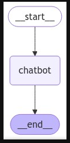

# Compréhension approfondie des concepts fondamentaux de LangGraph

LangGraph est un outil permettant de modéliser des flux de travail complexes utilisant des graphes d'agents. Un graphe est composé de nœuds (actions) reliés par des arêtes (transitions), structurant ainsi clairement l'exécution dynamique des workflows intelligents, tels que les chatbots, les assistants virtuels ou les systèmes décisionnels intelligents.

---

## 🛠️ Les concepts clés de LangGraph

### 2.1. État (State)

L'État est une structure de données globale représentant l'ensemble des informations partagées à travers le graphe. Il est généralement défini par des types Python comme `TypedDict` ou des modèles `Pydantic`.

**Exemple :**

```python
from typing_extensions import TypedDict

# État d'entrée du graphe
class InputState(TypedDict):
    user_input: str  # Entrée utilisateur initiale

# État de sortie du graphe
class OutputState(TypedDict):
    graph_output: str  # Résultat final produit par le graphe
```

---

### 2.2. Nœuds (Nodes)

Les nœuds sont des fonctions Python qui réalisent des opérations spécifiques, recevant un état courant et renvoyant un état mis à jour.

**Exemple :**

```python
# Exemple de nœud simple
def node_1(state: InputState) -> dict:
    # Concatène l'entrée utilisateur avec un texte fixe
    return {"foo": state["user_input"] + " name"}
```

---

### 2.3. Arêtes (Edges)

Les arêtes définissent les transitions entre les nœuds. Elles indiquent au graphe quel nœud doit être exécuté ensuite.

**Exemple :**

```python
from langgraph.graph import StateGraph, START

# Création du graphe avec états d'entrée et de sortie définis
builder = StateGraph(dict, input=InputState, output=OutputState)

# Ajout du nœud 'node_1'
builder.add_node("node_1", node_1)

# Création de l'arête reliant le démarrage au nœud
builder.add_edge(START, "node_1")
```

---

## 🔄 Mécanisme d'exécution du graphe LangGraph

LangGraph utilise un algorithme basé sur le passage de messages : chaque nœud, après exécution, transmet des mises à jour de l'état aux nœuds suivants via des messages transitant par les arêtes.

### 3.1. Super-pas (Super-steps)

Un super-pas est une phase d'exécution dans laquelle plusieurs nœuds peuvent s’exécuter en parallèle. Une séquence séquentielle implique des super-pas successifs.

---

## 📊 Types de graphes dans LangGraph

- **StateGraph** : graphe avec état défini par l'utilisateur.
- **MessageGraph** : spécialisé pour les échanges simples de messages (chatbots, interactions textuelles).

---

## 🔑 Les Réducteurs (Reducers)

Les réducteurs définissent comment les mises à jour des nœuds affectent l'état global, permettant une gestion efficace des états complexes, notamment pour les messages.

**Exemple avec un réducteur :**

```python
from typing import Annotated, List
from langchain_core.messages import AnyMessage
from langgraph.graph.message import add_messages

# État utilisant un réducteur pour gérer les messages
class State(TypedDict):
    messages: Annotated[List[AnyMessage], add_messages]
```

---

## 🔍 Compilation et validation du graphe

Avant exécution, le graphe doit être compilé afin d'en vérifier la cohérence et d'optimiser son fonctionnement :

```python
# Compilation finale du graphe
graph = builder.compile()
```

---

## 🤖 Exemple complet d'un Chatbot avec LangGraph

Exemple détaillé de chatbot simple :

```python
# Importation du modèle ChatOllama
from langchain_ollama import ChatOllama
llm = ChatOllama(model="llama3.2", max_tokens=1024, temperature=0)

# Importations nécessaires
from langgraph.graph import StateGraph, START, END
from langchain_core.messages import AnyMessage
from typing_extensions import TypedDict
from typing import Annotated, List
from langgraph.graph.message import add_messages

# Définition claire de l'état du chatbot
class State(TypedDict):
    messages: Annotated[List[AnyMessage], add_messages]

# Création du graphe
graph_builder = StateGraph(State)

# Définition du nœud chatbot
def chatbot(state: State):
    new_message = llm.invoke(state["messages"])
    return {"messages": [new_message]}

# Ajout des nœuds et des arêtes
graph_builder.add_node("chatbot", chatbot)
graph_builder.add_edge(START, "chatbot")
graph_builder.add_edge("chatbot", END)

# Compilation du graphe chatbot
graph = graph_builder.compile()
```

---

## 📉 Visualisation graphique

Visualisation graphique d'un graphe :

```python
from IPython.display import Image, display

# Génération graphique du graphe en Mermaid
graph_image = graph.get_graph().draw_mermaid_png()

# Affichage du graphe
display(Image(graph_image))
```


---

## 📚 Conclusion et perspectives

Grâce à ce manuel détaillé et exhaustif, vous disposez désormais de toutes les connaissances nécessaires pour maîtriser LangGraph, en structurant efficacement des workflows intelligents basés sur des agents.

---